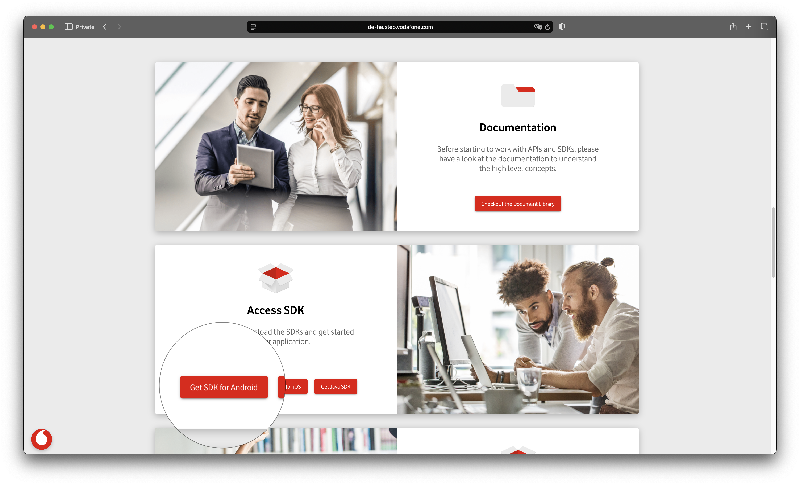
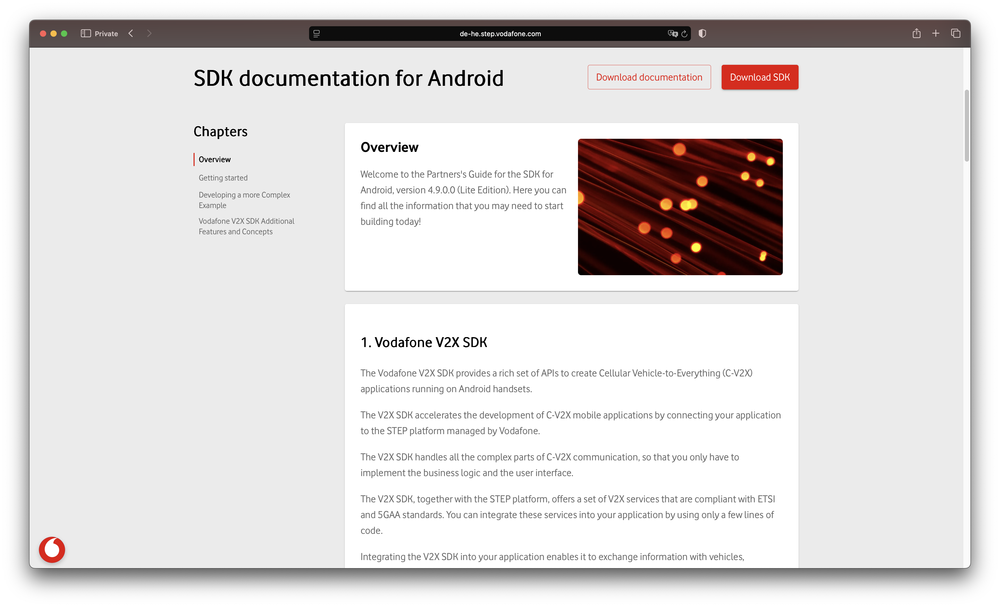
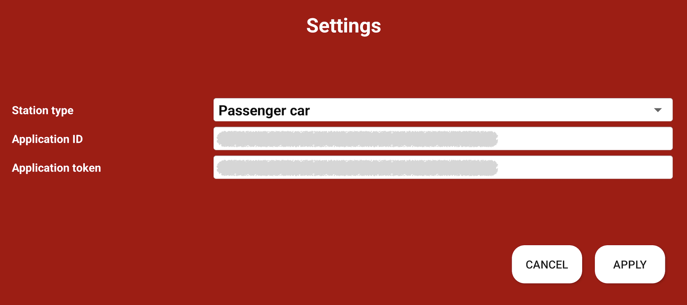

# HelloV2XWorld-Android

In this repository you can find an example of V2X application that shows how to use the V2X-SDK in a ready to use Android Application.

## Description

The HelloV2XWorld application demonstrates how easy it is to create a V2X application and exchange V2X messages with other road users .
This application is powered by the V2X-SDK and the STEP platform developed by Vodafone.
By cloning this project, you will be able to create and execute your first V2X application in less than 15 minutes.
The HelloV2XWorld application shows a map with all the road users close to your location.
You can also use this application as a model to start developing your own application.

## Getting Started

### Prerequisites

* Android Studio (2022.1.1 or upper) is already installed on your laptop.
* A software able to open rar & zip archives is already installed on your laptop.
* You have some experience in Android application development in Java using Android Studio.
* You already created One virtual device in Android Studio (Android 8 or higher).
* Your Internet connectivity is up and running.
* You are available for 15 minutes.

### Download the V2X-SDK library for Android

* Register yourself on the [STEP Web portal](https://step.vodafone.com/)    

* Go to the [STEP Web portal](https://step.vodafone.com/) webpage and login.  
**=>Enter your credentials**   

**=>Enter your pin Code**   

* Navigate to "Access SDK" section and select the "Get SDK for Android" option.  

* In the "SDK documentation for Android" page , click on the "Download SDK" button.  

**=> Your browser downloads the archive "VodafoneV2X_Android_SDK.rar"**  
* Open the archive, extract the V2X-SDK library file called "Android V2X SDK Vabc-release.aar" and save it on your laptop. 

### Download the Android V2X-SDK documentation

* In the "SDK documentation for Android" page , click on the "Download documentation" button.  

**=> Your browser downloads the archive "Android_V2X_SDK_Documentation_Vabc.zip"**    
* Open the archive and save on your laptop the Javadoc and the user Guide

### Retrieve the Application_ID & Application_Token, you will need these 2 parameters later to configure the HelloV2XWorld app.

* Go the [Test application](https://de-he.step.vodafone.com/applications) Test Application Web page.
* Click on the Test Application button
  

* Click on the Next Button two times
* Select the Application ID option and Copy the ApplicationID and save it as ApplicationID
  

* Select the SDK Key option , copy the SDK Key and save it as ApplicationToken
  

  
  
### Clone the HelloV2XWorld Application

* Open Android Studio.
* Select "File" then "New" then "Project from Version Control".  
  
**=> A window called "Get from Version Control" appears.**

* In the field version Control select the option "Git".
* In the field URL set "https://github.com/Vodafone/HelloV2XWorld-Android.git".
* Click on the "Clone" button.  

* Wait until the completion of this operation.

### Import the V2X-SDK library in your project

* Copy the "v2xsdk-release.aar" file to the app/libs folder of your project.  

### Set the Application_ID & Application_Token in your project

### Build the HelloV2XWorld application

* Click on "Build" then "Make Project" (or use the shortcut "Ctrl+F9").  

### Run the HelloV2XWorld application on the virtual Android device

**Please, be aware that the HelloV2XWorld application needs to access to your location , it's why it requests the Location Permission.**  

* Select your virtual Device in Android Studio.  
  
* Press the RUN button.  

* Wait until the "Emulator - HelloV2XWorld"  windows appears.  

* Read the Term and Conditions, Scroll down and click on the "Accept" button.  
  
* Provide the Location Permission to the HelloV2XWorld application  

* A map is displayed centered on your current location  

* The blue icon represents yourself
* The red icons represent the other road users close to you   

* When clicking on the blue icon, app displays you ITS information: StationID, StationType, Speed, Heading  

* When clicking on any red icon, app displays you the CAM information: StationID, StationType, Speed, Heading   

* You can change your station type by accessing the setting page

   

## Version History

* 1.0.4.0
    * Initial Release

* 1.0.7.4
    * New V2X SDK V2 ETSI R2

## License

This project is licensed under the MIT License - see the LICENSE.md file for details

## Dependencies

* org.osmdroid:osmdroid-android:6.1.14 / Apache Software License Version 2.0
* com.github.barteksc:android-pdf-viewer:3.2.0-beta.1 / Apache 2.0
* com.jakewharton:process-phoenix:2.1.2	/ Apache 2.0
* pub.devrel:easypermissions:3.0.0 / Apache 2.0
* androidx.appcompat:appcompat:1.6.1 / Apache 2.0
* com.google.android.material:material:1.8.0 / Apache 2.0
* androidx.constraintlayout:constraintlayout:2.1.4	/ Apache 2.0
* com.jakewharton.timber:timber:5.0.1	/ Apache 2.0
* junit:junit:4.13.2	/ Eclipse Public License 1.0
* androidx.test.ext:junit:1.1.5	/ Apache 2.0
* androidx.test.espresso:espresso-core:3.5.1 / Apache 2.0

